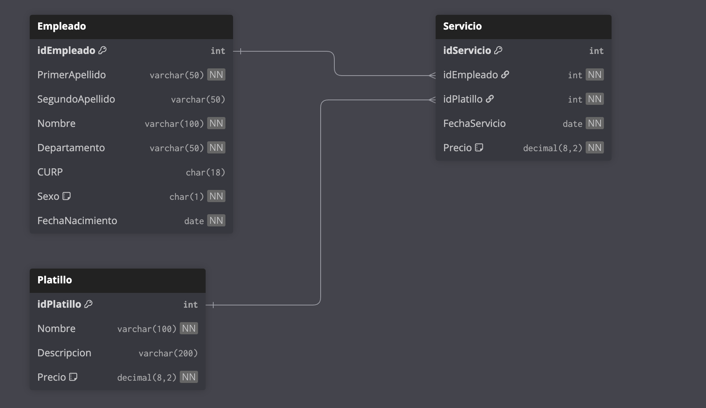

# 2da Oportunidad de Base de Datos I

**Grupo / Turno:** 434

---

## Contexto

**ComedorDB** modela el sistema de comedor subsidiado de una empresa. Los empleados pueden consumir un platillo por día; el precio se registra en el momento del servicio y puede diferir del precio vigente en el catálogo.

## Modelo de datos



| Tabla | Descripción | Registros |
|-------|-------------|-----------|
| `Empleado` | Catálogo de empleados por departamento | 25 |
| `Platillo` | Catálogo de platillos con precio vigente | 10 |
| `Servicio` | Hechos: consumo de un platillo por un empleado en una fecha | 54 |

### Departamentos representados

Producción, Administración, Recursos Humanos, Finanzas, Mantenimiento, Logística, Calidad, Ventas.

### Platillos disponibles

| idPlatillo | Nombre | Precio vigente |
|------------|--------|----------------|
| 1 | Pozole rojo | $45.00 |
| 2 | Enchiladas verdes | $40.00 |
| 3 | Tacos de bistec | $38.00 |
| 4 | Arroz con pollo | $42.00 |
| 5 | Milanesa de res | $48.00 |
| 6 | Sopa de lima | $35.00 |
| 7 | Tamales de rajas | $30.00 |
| 8 | Quesadillas de queso | $32.00 |
| 9 | Chile relleno | $44.00 |
| 10 | Frijoles charros | $28.00 |

## Instalación

Ejecuta los scripts en orden desde SSMS con **ComedorDB** seleccionada en el dropdown (excepto el primero, que crea la base de datos):

```
01-create-database.sql
02-create-table-empleado.sql
03-create-table-platillo.sql
04-create-table-servicio.sql
05-insert-empleado.sql
06-insert-platillo.sql
07-insert-servicio.sql
```

## Reversa

```
reversa/01-drop-database.sql
```
