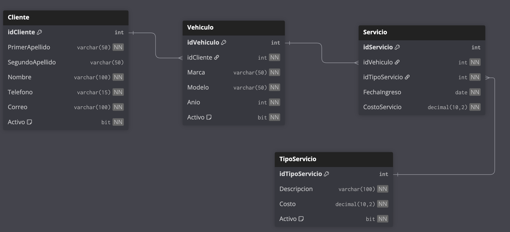

# Paquete de instalación — Sesión 10 · Ejercicio 2

Este documento describe el orden de ejecución de los scripts SQL de la sesión 10. Todos los scripts crean la base de datos **AutoFixDB**.

---

## Contexto

**AutoFix** es un taller mecánico que registraba sus órdenes de servicio en una hoja de cálculo plana. Este ejercicio modela su base de datos relacional con una tabla de hechos central (`Servicio`) y tres catálogos (`Cliente`, `Vehiculo`, `TipoServicio`).

---

## Modelo Relacional



---

## Prerequisito

Asegúrate de tener seleccionada la base de datos **AutoFixDB** en el dropdown de SSMS antes de ejecutar cualquier script (excepto el primero, que crea la base de datos).

---

## Instalación

### Paso 1 — Crear la base de datos

Ejecuta este script **una sola vez**. Si AutoFixDB ya existe, omítelo.

```
05-Ejercicio-2/instalacion/01-create-database.sql
```

> Después de ejecutarlo, selecciona **AutoFixDB** en el dropdown de SSMS.

---

### Paso 2 — Crear las tablas

Ejecuta en el orden indicado para respetar las llaves foráneas.

| # | Archivo | Descripción |
|---|---------|-------------|
| 1 | `instalacion/02-create-table-cliente.sql` | Catálogo de clientes |
| 2 | `instalacion/03-create-table-tiposervicio.sql` | Catálogo de tipos de servicio y costo |
| 3 | `instalacion/04-create-table-vehiculo.sql` | Vehículos vinculados a un cliente (FK → Cliente) |
| 4 | `instalacion/05-create-table-servicio.sql` | Tabla de hechos (FK → Vehiculo y TipoServicio) |

---

### Paso 3 — Insertar datos de prueba

| # | Archivo | Descripción |
|---|---------|-------------|
| 1 | `instalacion/06-insert-cliente.sql` | 200 clientes (exportados de Sesión 9) |
| 2 | `instalacion/07-insert-tiposervicio.sql` | 6 tipos de servicio |
| 3 | `instalacion/08-insert-vehiculo.sql` | 170 vehículos para clientes 1–155 |
| 4 | `instalacion/09-insert-servicio.sql` | 200 servicios distribuidos en vehículos 1–150 |

> El orden importa por las llaves foráneas: clientes y tipos de servicio primero, luego vehículos, luego servicios.

---

## Resumen de tablas en AutoFixDB

| Tabla | Registros | Descripción |
|-------|-----------|-------------|
| `Cliente` | 200 | Datos del dueño del vehículo |
| `TipoServicio` | 6 | Catálogo de tipos de servicio con costo fijo |
| `Vehiculo` | 170 | Vehículos registrados por cliente |
| `Servicio` | 200 | Cada visita al taller con snapshot del costo |

---

## Escenarios para practicar JOINs

| Escenario | Tablas involucradas |
|-----------|---------------------|
| Clientes **sin** vehículo registrado (ids 156–200) | `Cliente` ← `Vehiculo` |
| Vehículos **sin** servicios (ids 151–170) | `Vehiculo` ← `Servicio` |
| Clientes con múltiples vehículos (ids 1–15) | `Cliente` → `Vehiculo` |
| Vehículos con múltiples servicios | `Vehiculo` → `Servicio` |

---

## Reversa

Para deshacer todo lo instalado en esta sesión, ejecuta los siguientes scripts **en el orden indicado**.

> Asegúrate de tener seleccionada la base de datos **AutoFixDB** en el dropdown de SSMS antes de ejecutar el paso R1.

### Paso R1 — Eliminar las tablas

Las tablas deben eliminarse en orden inverso al de creación, respetando las dependencias de llaves foráneas.

| Orden | Tabla | Motivo |
|-------|-------|--------|
| 1° | `Servicio` | Depende de `Vehiculo` y de `TipoServicio`; debe ir primero |
| 2° | `Vehiculo` | Depende de `Cliente`; ya no tiene dependientes |
| 3° | `TipoServicio` | Sin dependientes tras eliminar `Servicio` |
| 4° | `Cliente` | Sin dependientes tras eliminar `Vehiculo` |

```
05-Ejercicio-2/reversa/01-drop-tables.sql
```

### Paso R2 — Eliminar la base de datos

> **Antes de ejecutar este script**, selecciona otra base de datos en el dropdown (por ejemplo: `master`). No puedes eliminar una base de datos a la que estás conectado.

```
05-Ejercicio-2/reversa/02-drop-database.sql
```
