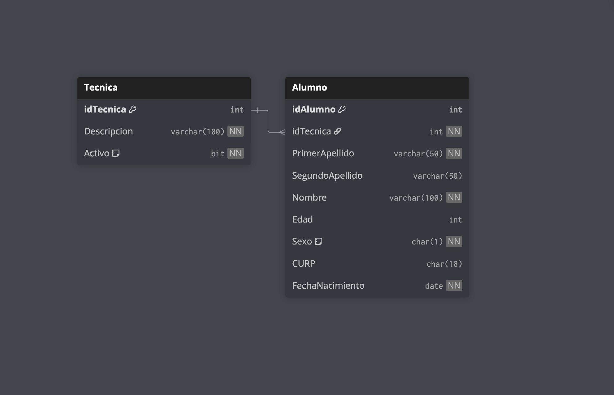

# Paquete de instalación — Sesión 9 · Ejercicio 1

Este documento describe el orden de ejecución de los scripts SQL de la sesión 9. Todos los scripts crean la base de datos **EscuelaDB**.

---

## Contexto

**EscuelaDB** modela el catálogo de carreras técnicas de una escuela y sus alumnos inscritos. Es la base de datos de práctica para ejercicios de JOIN entre dos tablas relacionadas.

---

## Modelo Relacional



---

## Prerequisito

Asegúrate de tener seleccionada la base de datos **EscuelaDB** en el dropdown de SSMS antes de ejecutar cualquier script (excepto el primero, que crea la base de datos).

---

## Instalación

### Paso 1 — Crear la base de datos

Ejecuta este script **una sola vez**. Si EscuelaDB ya existe, omítelo.

```
04-Ejercicio-1/instalacion/01-create-database.sql
```

> Después de ejecutarlo, selecciona **EscuelaDB** en el dropdown de SSMS.

---

### Paso 2 — Crear las tablas

Ejecuta en el orden indicado para respetar las llaves foráneas.

| # | Archivo | Descripción |
|---|---------|-------------|
| 1 | `instalacion/02-create-table-tecnica.sql` | Catálogo de carreras técnicas con baja lógica |
| 2 | `instalacion/03-create-table-alumno.sql` | Alumnos inscritos (FK → Tecnica) |

---

### Paso 3 — Insertar datos de prueba

| # | Archivo | Descripción |
|---|---------|-------------|
| 1 | `instalacion/04-insert-tecnica.sql` | Inserta las 8 técnicas del catálogo |
| 2 | `instalacion/05-insert-alumno.sql` | Inserta 200 alumnos distribuidos en las 8 técnicas |

> El orden importa por la llave foránea: primero técnicas, luego alumnos.

---

## Resumen de tablas en EscuelaDB

| Tabla | Registros | Descripción |
|-------|-----------|-------------|
| `Tecnica` | 8 | Catálogo de carreras técnicas con baja lógica |
| `Alumno` | 200 | Alumnos inscritos, cada uno asignado a una técnica (con baja lógica) |

---

## Reversa

Para deshacer todo lo instalado en esta sesión, ejecuta los siguientes scripts **en el orden indicado**.

> Asegúrate de tener seleccionada la base de datos **EscuelaDB** en el dropdown de SSMS antes de ejecutar el paso R1.

### Paso R1 — Eliminar las tablas

Las tablas deben eliminarse en orden inverso al de creación, respetando las dependencias de llaves foráneas.

| Orden | Tabla | Motivo |
|-------|-------|--------|
| 1° | `Alumno` | Depende de `Tecnica` mediante FK; debe ir primero |
| 2° | `Tecnica` | Sin dependientes tras eliminar `Alumno` |

```
04-Ejercicio-1/reversa/01-drop-tables.sql
```

### Paso R2 — Eliminar la base de datos

> **Antes de ejecutar este script**, selecciona otra base de datos en el dropdown (por ejemplo: `master`). No puedes eliminar una base de datos a la que estás conectado.

```
04-Ejercicio-1/reversa/02-drop-database.sql
```
