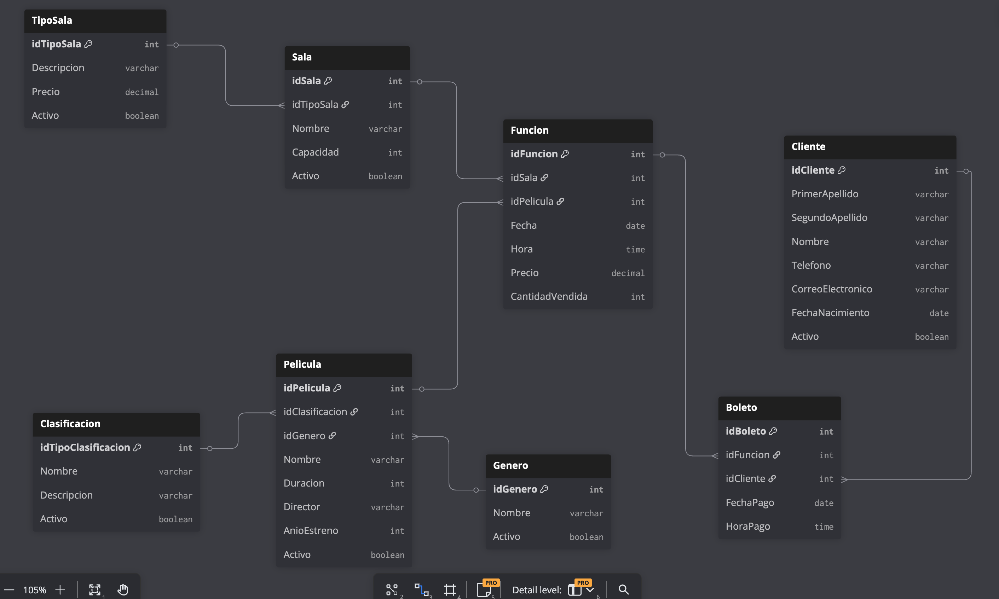

# Paquete de instalación — Sesión Final · CineDB

---

## Contexto

**CineDB** es la base de datos de un cine que opera con múltiples salas físicas clasificadas
por tipo: 2D, 3D, IMAX y VIP. Cada tipo de sala tiene un precio de boleto fijo que puede
cambiar con el tiempo; el precio no depende de la película proyectada sino del tipo de sala.

El cine maneja un catálogo de películas organizadas por género. Cada película pertenece a un
solo género y tiene una clasificación (AA, A, B o C) que indica el público al que está
dirigida.

El cine programa **funciones**: la proyección de una película específica en una sala específica
en una fecha y hora determinadas. El precio del boleto se toma del tipo de sala en el momento
en que se registra la función y queda fijo — si el precio del tipo de sala cambia después,
las funciones ya programadas conservan el precio original.

Todo comprador debe estar registrado como **cliente**. Cuando un cliente asiste acompañado,
compra un boleto por cada asiento que ocupa su grupo; los acompañantes no necesitan
registrarse. Cada boleto queda vinculado al cliente que lo compró y a la función a la que
corresponde, formando el historial de asistencia del cliente.

---

## El problema

Actualmente el cine lleva dos hojas de cálculo separadas: una para las funciones programadas
y otra para la venta de boletos. La hoja de funciones contiene:

> Nombre de la sala, tipo de sala, precio actual, nombre de la película, género, director,
> duración en minutos, clasificación, año de estreno, fecha de función, hora de inicio.

La hoja de boletos contiene:

> Nombre completo del cliente, teléfono, correo, fecha de nacimiento, nombre de la película,
> nombre de la sala, fecha de función, hora de inicio, precio pagado.

El encargado ha identificado los siguientes problemas:

- Cuando el precio de un tipo de sala cambia, hay que actualizar manualmente todas las filas
  futuras de ese tipo en la hoja de funciones, lo que ha generado precios contradictorios
  para el mismo tipo de sala.
- No es posible saber qué películas forman parte del catálogo si aún no tienen funciones
  programadas.
- No existe forma de consultar qué salas están disponibles en un horario determinado sin
  revisar manualmente toda la hoja.
- Los datos del cliente se repiten en cada boleto que compra, con frecuentes diferencias en
  el teléfono o correo respecto a compras anteriores.
- No hay forma de agrupar los boletos que un cliente compró en una misma visita, ni de saber
  si asistió a diferentes funciones en distintas fechas.

---

## Reglas de negocio

- El precio de un boleto depende del **tipo de sala**, no de la película. Los tipos de sala
  disponibles son: 2D ($90), 3D ($130), IMAX ($180) y VIP ($220).
- El precio se registra en la función al momento de programarse. Si el precio del tipo de
  sala cambia después, las funciones ya registradas conservan el precio original.
- Una sala no puede tener dos funciones con la misma fecha y hora de inicio.
- Todo comprador de boleto debe ser un cliente registrado. Si un cliente va con acompañantes,
  compra un boleto por cada asiento — los acompañantes no necesitan registrarse.
- Las películas tienen una clasificación que indica el público al que están dirigidas:

  | Clasificación | Descripción |
  |---------------|-------------|
  | AA | Apta para todo público |
  | A | Público en general |
  | B | Mayores de 15 años |
  | C | Mayores de 18 años |

---

## Modelo Relacional

```
Table TipoSala {
  idTipoSala int [pk, increment]
  Descripcion varchar
  Precio decimal
  Activo boolean
}

Table Sala {
  idSala int [pk, increment]
  idTipoSala int [ref: > TipoSala.idTipoSala]
  Nombre varchar
  Capacidad int
  Activo boolean
}

Table Clasificacion {
  idClasificacion int [pk, increment]
  Nombre varchar
  Descripcion varchar
  Activo boolean
}

Table Genero {
  idGenero int [pk, increment]
  Nombre varchar
  Activo boolean
}

Table Pelicula {
  idPelicula int [pk, increment]
  idClasificacion int [ref: > Clasificacion.idClasificacion]
  idGenero int [ref: > Genero.idGenero]
  Nombre varchar
  Duracion int
  Director varchar
  AnioEstreno int
  Activo boolean
}

Table Funcion {
  idFuncion int [pk, increment]
  idSala int [ref: > Sala.idSala]
  idPelicula int [ref: > Pelicula.idPelicula]
  Fecha date
  Hora time
  Precio decimal
  CantidadVendida int
}

Table Cliente {
  idCliente int [pk, increment]
  PrimerApellido varchar
  SegundoApellido varchar
  Nombre varchar
  Telefono varchar
  CorreoElectronico varchar
  FechaNacimiento date
  Activo boolean
}

Table Boleto {
  idBoleto int [pk, increment]
  idFuncion int [ref: > Funcion.idFuncion]
  idCliente int [ref: > Cliente.idCliente]
  FechaPago date
  HoraPago time
}
```



---

## Limitaciones conocidas del modelo

- **Solapamiento de funciones:** el modelo detecta cuando dos funciones tienen exactamente la
  misma hora de inicio en la misma sala, pero no cuando se traslapan. Es posible registrar una
  función a las 18:01 en una sala que ya tiene una a las 18:00 con duración de dos horas.
  Resolver esto requeriría lógica adicional fuera del alcance de este ejercicio.
- **Clasificación por edad:** el modelo almacena la clasificación de la película y la fecha
  de nacimiento del cliente, pero no valida automáticamente que el cliente cumpla la edad
  requerida al comprar un boleto. Esa validación queda fuera del alcance de este ejercicio.
- **Agrupación de compras en un ticket:** en un sistema real, un cliente podría comprar en
  una sola transacción boletos para funciones distintas. Esto se modela con una tabla
  intermedia `Ticket` entre `Cliente` y `Boleto`. Esta extensión está al alcance del modelo
  relacional visto en el curso, pero se omite para mantener el ejercicio manejable.

---

## Prerequisito

Asegúrate de tener seleccionada la base de datos **CineDB** en el dropdown de SSMS antes de
ejecutar cualquier script (excepto el primero, que crea la base de datos).

---

## Instalación

### Paso 1 — Crear la base de datos

Ejecuta este script **una sola vez**. Si CineDB ya existe, omítelo.

```
CineDB/instalacion/01-create-database.sql
```

> Después de ejecutarlo, selecciona **CineDB** en el dropdown de SSMS.

---

### Paso 2 — Crear las tablas

Ejecuta en el orden indicado para respetar las llaves foráneas.

| # | Archivo | Descripción |
|---|---------|-------------|
| 1 | `instalacion/02-create-table-tiposala.sql` | Catálogo de tipos de sala con precio base |
| 2 | `instalacion/03-create-table-clasificacion.sql` | Clasificaciones de edad para películas |
| 3 | `instalacion/04-create-table-genero.sql` | Géneros cinematográficos |
| 4 | `instalacion/05-create-table-cliente.sql` | Clientes registrados |
| 5 | `instalacion/06-create-table-sala.sql` | Salas físicas del cine (FK → TipoSala) |
| 6 | `instalacion/07-create-table-pelicula.sql` | Catálogo de películas (FK → Clasificacion, Genero) |
| 7 | `instalacion/08-create-table-funcion.sql` | Funciones programadas (FK → Sala, Pelicula) |
| 8 | `instalacion/09-create-table-boleto.sql` | Boletos vendidos (FK → Funcion, Cliente) |

---

### Paso 3 — Insertar datos de prueba

| # | Archivo | Descripción |
|---|---------|-------------|
| 1 | `instalacion/10-insert-tiposala.sql` | 4 tipos de sala con precio fijo |
| 2 | `instalacion/11-insert-clasificacion.sql` | 4 clasificaciones de edad (AA, A, B, C) |
| 3 | `instalacion/12-insert-genero.sql` | 20 géneros cinematográficos |
| 4 | `instalacion/13-insert-sala.sql` | 18 salas distribuidas en los 4 tipos |
| 5 | `instalacion/14-insert-cliente.sql` | 40 clientes (exportados de Sesiones 9 y 10) |
| 6 | `instalacion/15-insert-pelicula.sql` | 30 películas del catálogo 2023–2025 |
| 7 | `instalacion/16-insert-funcion.sql` | 90 funciones en mayo y junio 2026 |
| 8 | `instalacion/17-insert-boleto.sql` | 100 boletos vendidos entre clientes de mayo y junio |

> El orden importa por las llaves foráneas: catálogos primero, luego salas y películas, luego funciones, luego boletos.

---

## Resumen de tablas en CineDB

| Tabla | Registros | Descripción |
|-------|-----------|-------------|
| `TipoSala` | 4 | Tipo de sala con precio base (2D, 3D, IMAX, VIP) |
| `Clasificacion` | 4 | Clasificación de edad de la película (AA, A, B, C) |
| `Genero` | 20 | Géneros cinematográficos |
| `Cliente` | 40 | Compradores registrados (exportados de Sesiones 9 y 10) |
| `Sala` | 18 | Salas físicas del cine |
| `Pelicula` | 30 | Catálogo de películas 2023–2025 |
| `Funcion` | 90 | Proyecciones programadas (3 por película, mayo y junio 2026) |
| `Boleto` | 100 | Boletos vendidos en mayo y junio 2026 |

---

## Escenarios para practicar JOINs

| Escenario | Tablas involucradas |
|-----------|---------------------|
| Clientes **sin** boletos comprados | `Cliente` ← `Boleto` |
| Funciones **sin** boletos vendidos | `Funcion` ← `Boleto` |
| Clientes que compraron boletos para acompañantes (mismo idFuncion, mismo idCliente) | `Cliente` → `Boleto` |
| Precio del boleto según tipo de sala | `Boleto` → `Funcion` → `Sala` → `TipoSala` |
| Películas con su clasificación y género | `Pelicula` → `Clasificacion`, `Pelicula` → `Genero` |

---

## Reversa

Para deshacer todo lo instalado en esta sesión, ejecuta los siguientes scripts **en el orden indicado**.

> Asegúrate de tener seleccionada la base de datos **CineDB** en el dropdown de SSMS antes de ejecutar el paso R1.

### Paso R1 — Eliminar las tablas

Las tablas deben eliminarse en orden inverso al de creación, respetando las dependencias de llaves foráneas.

| Orden | Tabla | Motivo |
|-------|-------|--------|
| 1° | `Boleto` | Depende de `Funcion` y de `Cliente`; debe ir primero |
| 2° | `Funcion` | Depende de `Sala` y de `Pelicula` |
| 3° | `Pelicula` | Depende de `Clasificacion` y de `Genero` |
| 4° | `Sala` | Depende de `TipoSala` |
| 5° | `Cliente` | Sin dependientes tras eliminar `Boleto` |
| 6° | `Genero` | Sin dependientes tras eliminar `Pelicula` |
| 7° | `Clasificacion` | Sin dependientes tras eliminar `Pelicula` |
| 8° | `TipoSala` | Sin dependientes tras eliminar `Sala` |

```
CineDB/reversa/01-drop-tables.sql
```

### Paso R2 — Eliminar la base de datos

> **Antes de ejecutar este script**, selecciona otra base de datos en el dropdown (por ejemplo: `master`). No puedes eliminar una base de datos a la que estás conectado.

```
CineDB/reversa/02-drop-database.sql
```
