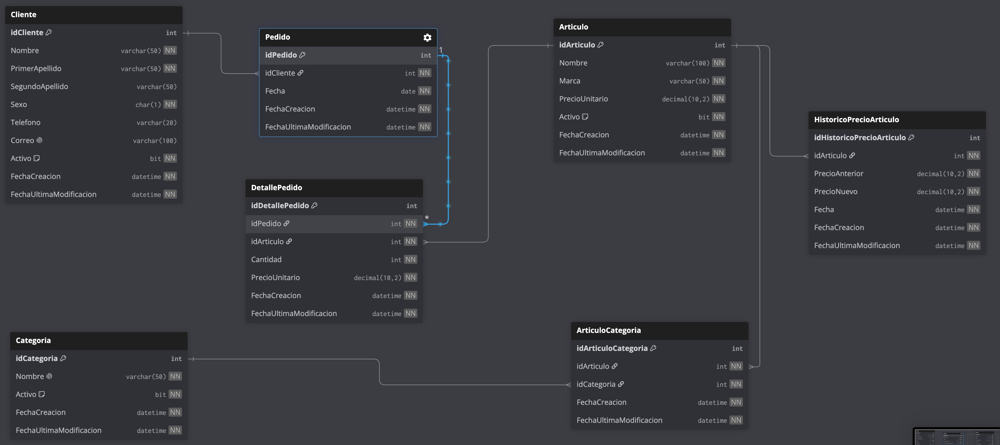

# Sesión 5 — CompuStoreDB: modelado, N:N y auditoría

Retoma el ejercicio del PIA de Base de Datos I ([equipo-3.md](../../../base-datos-1/evidencias/archivos-pia/ejercicios/equipo-3.md) — CompuStore, tienda de artículos de cómputo) y lo evoluciona con temas propios de Base de Datos II: campos de auditoría, catálogos con baja lógica (`Activo`), una relación N:N resuelta con tabla puente, y una tabla de historial de precios.

---

## Modelo

7 tablas:

| Tabla | Descripción |
|-------|-------------|
| `Categoria` | Catálogo de categorías de artículos (Laptops, Monitores, Teclados, etc.) |
| `Articulo` | Catálogo de artículos, con precio de lista vigente |
| `ArticuloCategoria` | Tabla puente — relación **N:N** entre `Articulo` y `Categoria` |
| `HistoricoPrecioArticulo` | Historial de cambios de precio de un artículo (`PrecioAnterior` → `PrecioNuevo`), **1:N** con `Articulo` |
| `Cliente` | Catálogo de clientes |
| `Pedido` | Encabezado de pedido — **1:N** con `Cliente` |
| `DetallePedido` | Líneas de un pedido (artículo, cantidad, precio al momento de la venta) — **1:N** con `Pedido`, N:1 con `Articulo` |

Todas las tablas tienen `FechaCreacion` y `FechaUltimaModificacion` (auditoría). Los catálogos (`Categoria`, `Articulo`, `Cliente`) además tienen `Activo BIT` para baja lógica.

`Articulo.PrecioUnitario` es el precio de lista vigente; `DetallePedido.PrecioUnitario` conserva el precio real de cada venta aunque el precio de lista cambie después. El registro en `HistoricoPrecioArticulo` es manual (no hay trigger todavía).

---

## Paquete de instalación

Ver [`CompuStoreDB/instalacion`](CompuStoreDB/instalacion):

| # | Archivo | Contenido |
|---|---------|-----------|
| 01 | `01-create-database.sql` | `CREATE DATABASE CompuStoreDB` |
| 02 | `02-create-table-categoria.sql` | Tabla `Categoria` |
| 03 | `03-create-table-articulo.sql` | Tabla `Articulo` |
| 04 | `04-create-table-articulocategoria.sql` | Tabla puente `ArticuloCategoria` |
| 05 | `05-create-table-historicoprecioarticulo.sql` | Tabla `HistoricoPrecioArticulo` |
| 06 | `06-create-table-cliente.sql` | Tabla `Cliente` |
| 07 | `07-create-table-pedido.sql` | Tabla `Pedido` |
| 08 | `08-create-table-detallepedido.sql` | Tabla `DetallePedido` |
| 09 | `09-insert-categoria.sql` | 11 categorías |
| 10 | `10-insert-articulo.sql` | 51 artículos |
| 11 | `11-insert-articulocategoria.sql` | 55 relaciones Articulo-Categoria (4 artículos en 2 categorías, para ilustrar la N:N) |
| 12 | `12-insert-cliente.sql` | 25 clientes |

`Pedido`, `DetallePedido` y `HistoricoPrecioArticulo` se crean vacías — son tablas de hechos/historial, no catálogos, y no había datos reales que reutilizar para ellas.

Reversa en [`CompuStoreDB/reversa`](CompuStoreDB/reversa): elimina las tablas en orden inverso a las llaves foráneas y luego la base de datos.

---

## Origen de los datos

- **`Categoria`/`Articulo`**: no existía ninguna base de datos previa del curso con artículos de cómputo. Los 51 artículos (nombre, marca, precio) se tomaron de material de asesoría personal (`Base de Datos II 2024/Sesión 2024-11-09`) y se adaptaron al modelo de CompuStore, separando marca del nombre y clasificándolos en 11 categorías.
- **`Cliente`**: los 25 primeros clientes reales de `AutoFixDB` (Base de Datos I, [`sesion-10`](../../../base-datos-1/sesiones/sesion-10/05-Ejercicio-2/instalacion/06-insert-cliente.sql)), agregando el campo `Sexo` que no existía en el origen.

## Constraints agregados

- `PRIMARY KEY` con `IDENTITY(1,1)` en todas las tablas.
- `FOREIGN KEY` nombradas (`fk_<Tabla>_<TablaReferenciada>`) en todas las relaciones.
- `UNIQUE` en `Categoria.Nombre`; `Articulo` (`Nombre`, `Marca`); `Cliente.Correo` y `Cliente.Telefono`; y en el par (`idArticulo`, `idCategoria`) de `ArticuloCategoria`, para no duplicar la misma relación.
- `CHECK` en precios y cantidades (`> 0`), en `Cliente.Sexo` (`IN ('M', 'F')`), y en `HistoricoPrecioArticulo` para que `PrecioNuevo` sea distinto de `PrecioAnterior` (no registrar un "cambio" que no cambió nada).
- `DEFAULT 1` en todos los `Activo`, y `DEFAULT GETDATE()` en los campos de auditoría.

---

## Refactor de nomenclatura: `sp_` → `usp_` en CineDB

Aprovechando esta sesión, se renombraron los 3 procedimientos almacenados de CineDB creados en las sesiones 3 y 4 (`sp_obtenerNombreCliente`, `sp_insertarPelicula`, `sp_eliminarPelicula`) al prefijo `usp_`, tanto en la instancia de AWS como en los scripts del repo (ver notas de nomenclatura en [sesión 3](../sesion-3/README.md) y [sesión 4](../sesion-4/README.md#nota-de-nomenclatura)).

`sp_` está reservado por SQL Server para procedimientos del sistema (siempre se busca primero en `master`); `usp_` es la convención definida en el [CLAUDE.md](../../../CLAUDE.md) del repo. En la instancia, cada procedimiento se recreó (`DROP` + `CREATE`) bajo el nuevo nombre con el mismo cuerpo, y se verificó que siguieran funcionando igual (`EXECUTE` de cada uno con datos válidos e inválidos).
